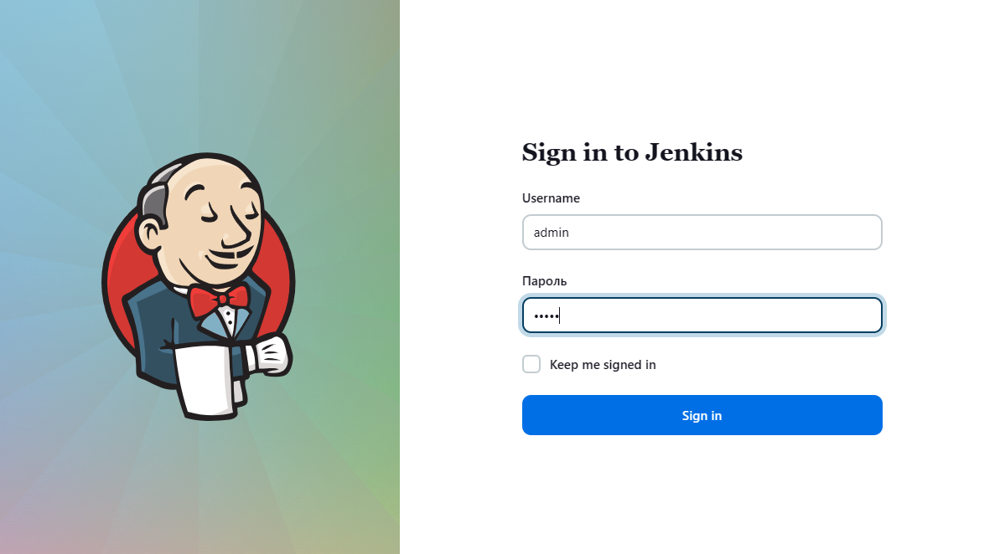
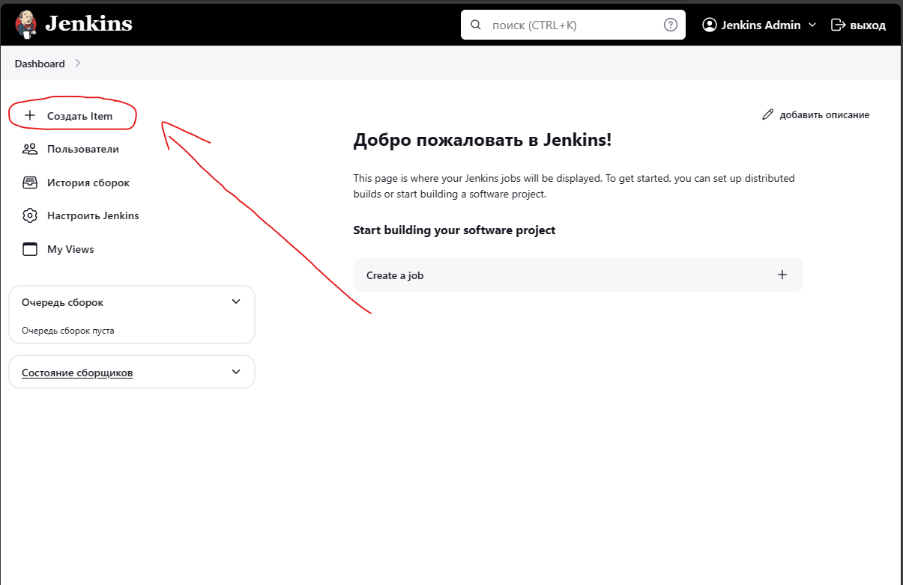
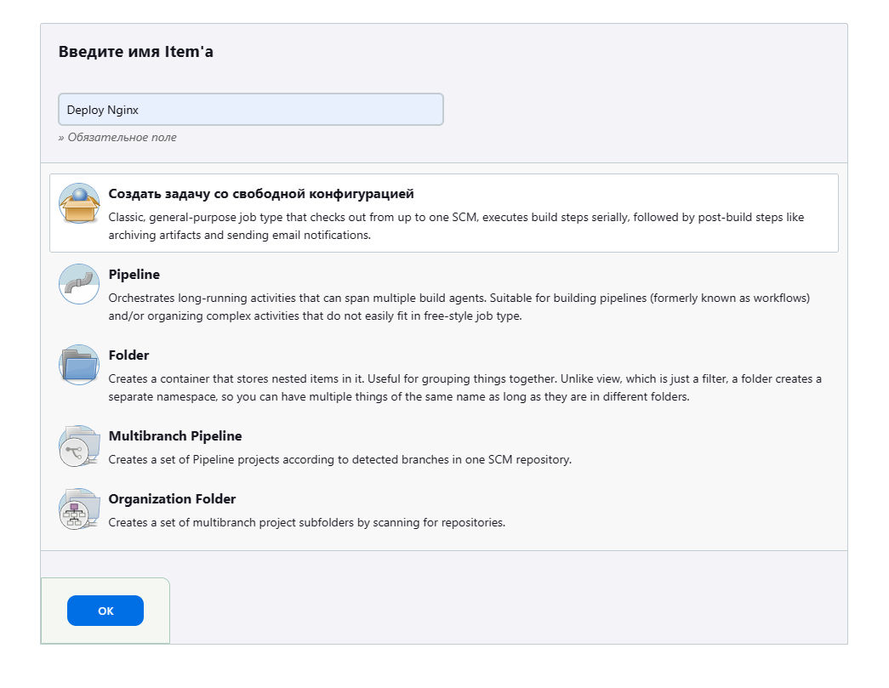
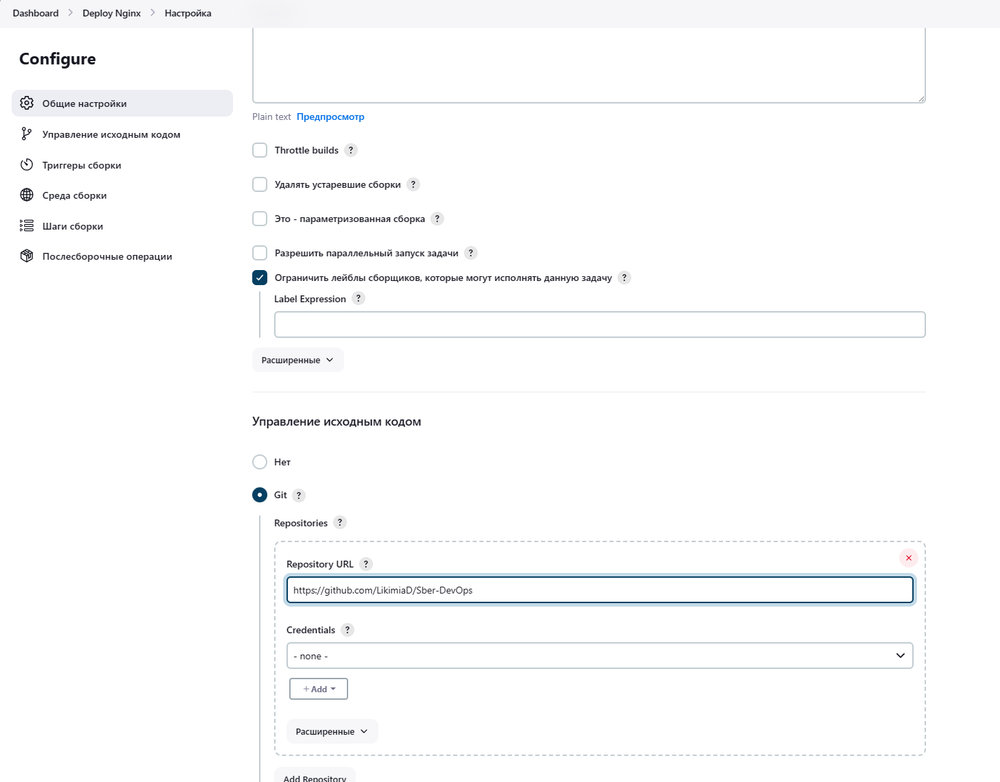

# Sber Task

## Инструкция по запуску

### Шаг 0: Установка Docker

#### Добавляем репозиторий докера (чтобы получить последнюю его версию)

```sh
sudo apt-get update
```
```sh
sudo apt-get install \
    ca-certificates \
    curl \
    gnupg \
    lsb-release -y
```
```sh
sudo mkdir -p /etc/apt/keyrings
```
```sh
curl -fsSL https://download.docker.com/linux/ubuntu/gpg | sudo gpg --dearmor -o /etc/apt/keyrings/docker.gpg
```
```sh
echo \
  "deb [arch=$(dpkg --print-architecture) signed-by=/etc/apt/keyrings/docker.gpg] https://download.docker.com/linux/ubuntu \
  $(lsb_release -cs) stable" | sudo tee /etc/apt/sources.list.d/docker.list > /dev/null
```

#### Устанавливаем docker

```sh
sudo apt-get update
```
```sh
sudo apt-get install docker-ce docker-ce-cli containerd.io -y
```

#### Устанавливаем docker-compose

```sh
sudo curl -L "https://github.com/docker/compose/releases/download/v2.6.0/docker-compose-$(uname -s)-$(uname -m)" -o /usr/local/bin/docker-compose
```

```sh
sudo chmod +x /usr/local/bin/docker-compose
```

### Шаг 1: Установка kubectl в Linux

#### Установка версии 1.30.0 для Linux

```sh
curl -LO https://dl.k8s.io/release/v1.30.0/bin/linux/amd64/kubectl
```

#### Сделайте бинарный файл kubectl исполняемым

```sh
chmod +x ./kubectl
```

#### Переместите бинарный файл в директорию из переменной окружения PATH:

```sh
sudo mv ./kubectl /usr/local/bin/kubectl
```

#### Убедиться что установлена нужная версия

```sh
kubectl version --client
```

### Шаг 2: Установка Minikube

#### Скачивание и установка Minikube

```sh
curl -Lo minikube https://storage.googleapis.com/minikube/releases/latest/minikube-linux-amd64
chmod +x minikube
sudo install minikube /usr/local/bin/
```

#### Запуск Minikube

```sh
minikube start --driver=docker
```

### Шаг 3: Установка helm

#### Установка Helm на Linux

Можете установить Helm, используя snap, как предлагается в вашем терминале, или скачать его напрямую:

```sh
sudo snap install helm --classic
```
или
```sh
curl -fsSL -o get_helm.sh https://raw.githubusercontent.com/helm/helm/main/scripts/get-helm-3
chmod 700 get_helm.sh
./get_helm.sh
```

### Шаг 4: Создание и конфигурация Helm чарта для Nginx

#### Создание чарта Nginx и переход в него

```sh
mkdir my-nginx
cd my-nginx
helm create nginx
cd nginx/
```

#### Редактирование `values.yaml`
Открыть файл в редакторе

```sh
nano values.yaml
```

Найдите секцию, связанную с сервисом (service), и измените её:

```yml
image:
  repository: nginx
  tag: latest
  pullPolicy: IfNotPresent

service:
  type: NodePort
  port: 80
  nodePort: 32080
```

#### Проверка `deployment.yaml`
Открыть файл в редакторе

```sh
nano templates/deployment.yaml
```

Проверить что `containers` выглядят вот так:

```yml
containers:
  - name: {{ .Chart.Name }}
    image: "{{ .Values.image.repository }}:{{ .Values.image.tag | default .Chart.AppVersion }}"
    imagePullPolicy: {{ .Values.image.pullPolicy }}
    securityContext:
      {{- toYaml .Values.securityContext | nindent 12 }}
    ports:
      - name: http
        containerPort: {{ .Values.service.port }}
        protocol: TCP
```

#### Редактирование `service.yaml` в директории `templates`:
Открыть файл в редакторе

```sh
nano templates/service.yaml
```

Убедитесь, что сервис настроен для использования порта и типа, указанных в `values.yaml`.
```sh
apiVersion: v1
kind: Service
metadata:
  name: {{ include "nginx.fullname" . }}
  labels:
    {{- include "nginx.labels" . | nindent 4 }}
spec:
  type: {{ .Values.service.type }}
  ports:
    - port: {{ .Values.service.port }}
      nodePort: {{ .Values.service.nodePort }}
      protocol: TCP
      name: http
  selector:
    {{- include "nginx.selectorLabels" . | nindent 4 }}
```

#### Пакетирование чарта

```sh
cd ..
helm package nginx/
```

#### Установка чарта в Minikube

```sh
helm install my-nginx ./nginx-0.1.0.tgz
```

#### Проверка

```sh
minikube service my-nginx --url
```

### Шаг 5: Развернуть Jenkins в Minikube

#### Добавление репозитория Helm для Jenkins

```sh
helm repo add jenkins https://charts.jenkins.io
helm repo update
```

#### Добавление репозитория Helm для Jenkins
Создать файл
```sh
nano jenkins-values.yaml
```
Заполнить по шаблону:
```yml
controller:
  serviceType: NodePort
  nodePort: 32082
  admin:
    username: admin
    password: admin
persistence:
  enabled: false
```
Установить
```sh
helm install jenkins jenkins/jenkins -f jenkins-values.yaml
```
Проверить пароль администратора
```sh
printf $(kubectl get secret --namespace default jenkins -o jsonpath="{.data.jenkins-admin-password}" | base64 --decode);echo
```

#### Получение URL для доступа к Jenkins:

```sh
export NODE_PORT=$(kubectl get --namespace default -o jsonpath="{.spec.ports[0].nodePort}" services jenkins)
export NODE_IP=$(minikube ip)
echo http://$NODE_IP:$NODE_PORT
```

#### Запуск

```sh
minikube service jenkins --url
```
Копируем URL

#### Пушим на Github наш helm чарт

```sh
git init
git add .
git branch -M main
git commit -m "Initial commit of Nginx Helm chart"
git remote add origin URL_вашего_репозитория_на_GitHub
git push -u origin main
```

### Шаг 5: Создание нового Job в Jetkins

Открываем URL, заходим под указанным ранее логином и паролем



#### Визуальная инструкция







